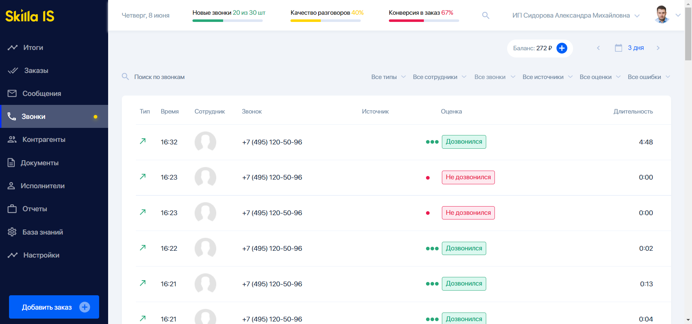
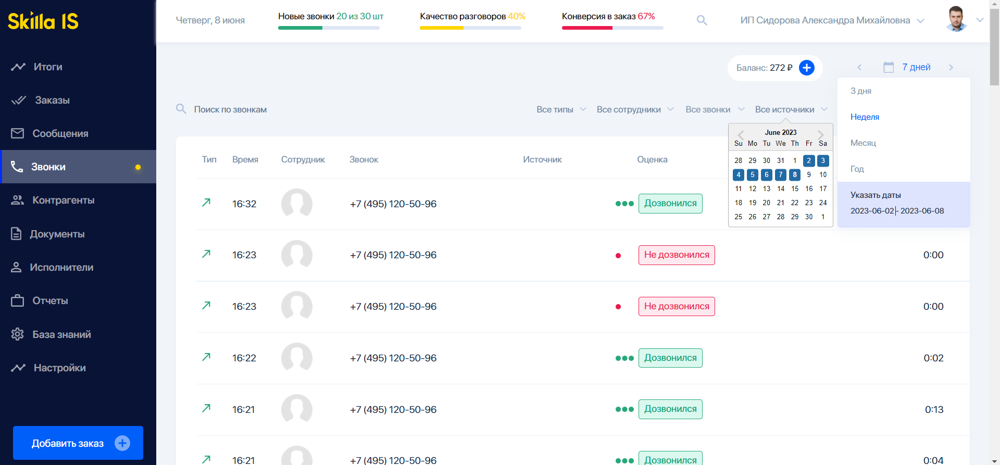
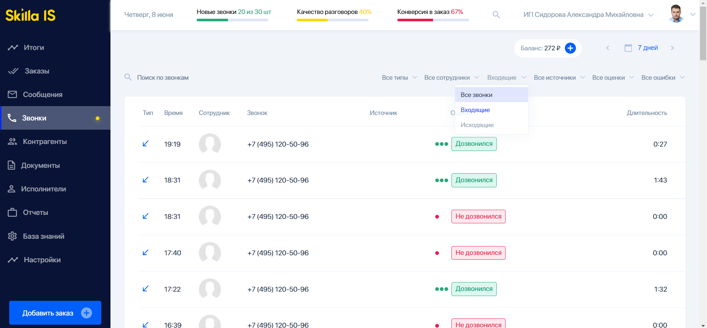
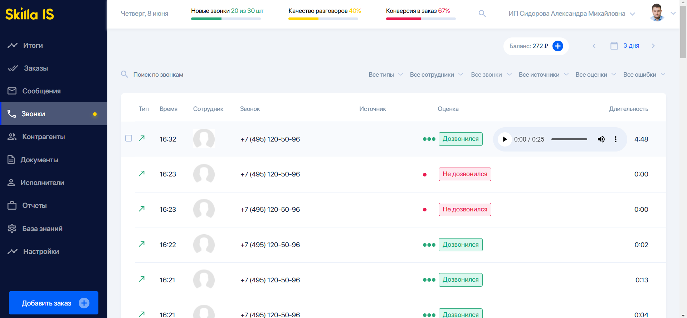

# Проект Test Skilla

## Реализовано:
1. Главная страница

    
2. Компоненты:
    - Навигационное меню
    - Шапка с текущей датой и информацией о пользователе
    - Выпадающее меню с опцией выбора дат

      

    - Фильтр по статусу звонка

      

    - Список звонков
3. Функционал:
    - Доступ к данным с помощью тестового токена
    - Вывод списка звонков
    - Фильтрация звонков по статусу (все, входящие, исходящие)
    - Фильтрация звонков за выбранный промежуток времени
    - Прослушивание аудиофайлов

      

5. Использованные хуки:
    - useState
    - useEffect
    - useContext

## Использованные технологии
  1. React
  2. JavaScript (JSX)
  3. Props, context
  4. SCSS 
  5. REST API
  6. React Select
  7. React Datepicker
  8. Git, GitHub 
  9. VercelApp

## Для запуска проекта нужно:
 - Перейти в директорию проекта
 - npm install / yarn add / pnpm install
 - Команда для запуска npm start
 - Команда для сборки npm run build  
